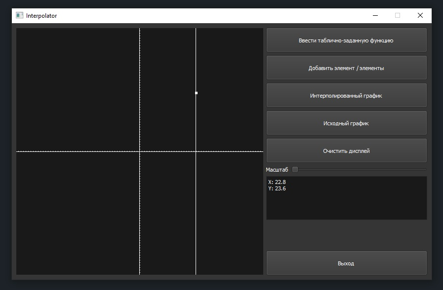
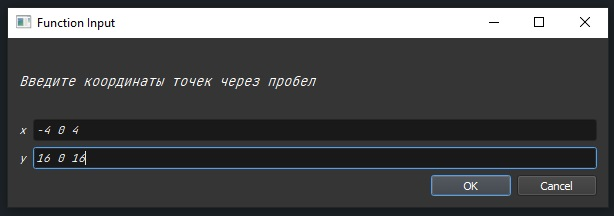
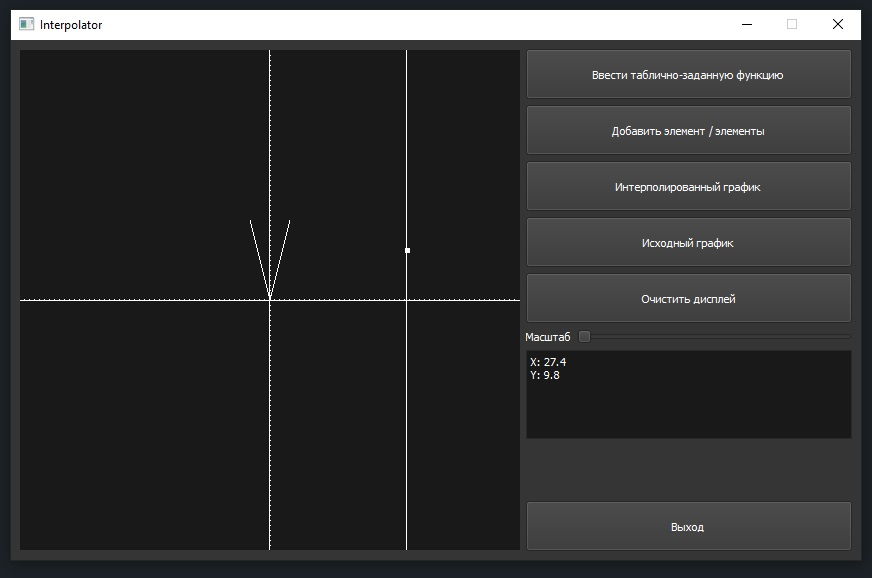
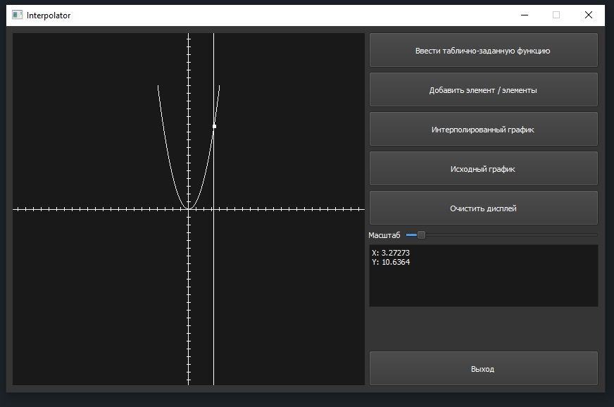
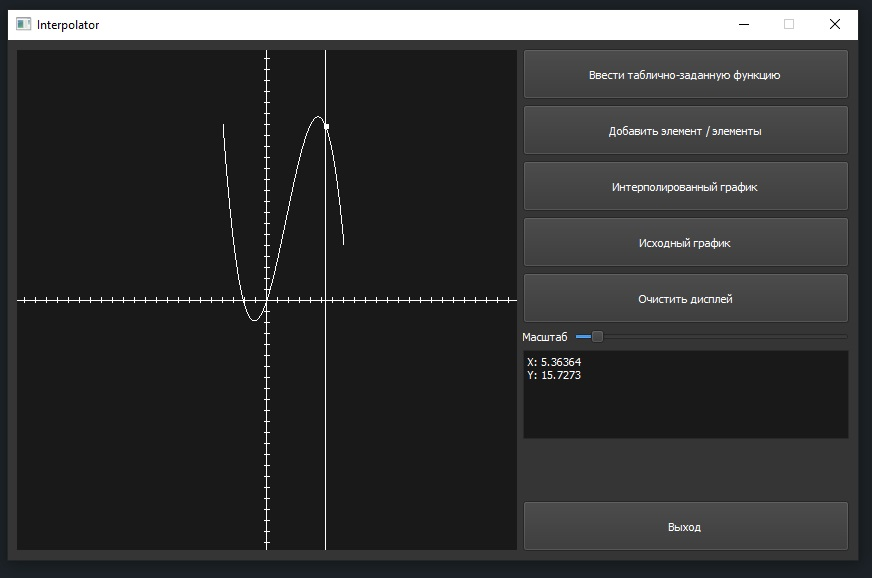

# Interpolator

I implemented this project during my familiarization with the QT framework.
It allows you to interpolate a function table and plot it.
Also you can add new points to the graph and rescale it.
The vertical line of the cursor is magnetized to the points of the interpolated graph so that you can see their coordinates.

## Realization

** The interface provided by QT framework.
** Graphics are drawn using OpenGL.
** Lagrange Polynomial is used to interpolate.

## Screenshots

### Interface

### Add function table window

### Graph view after adding a function

### Graph view after interpolating

### Graph view after adding a new point and interpolation

